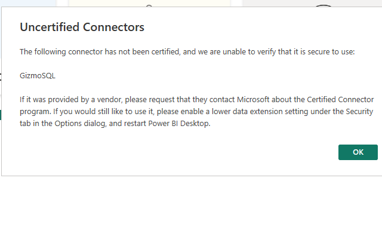
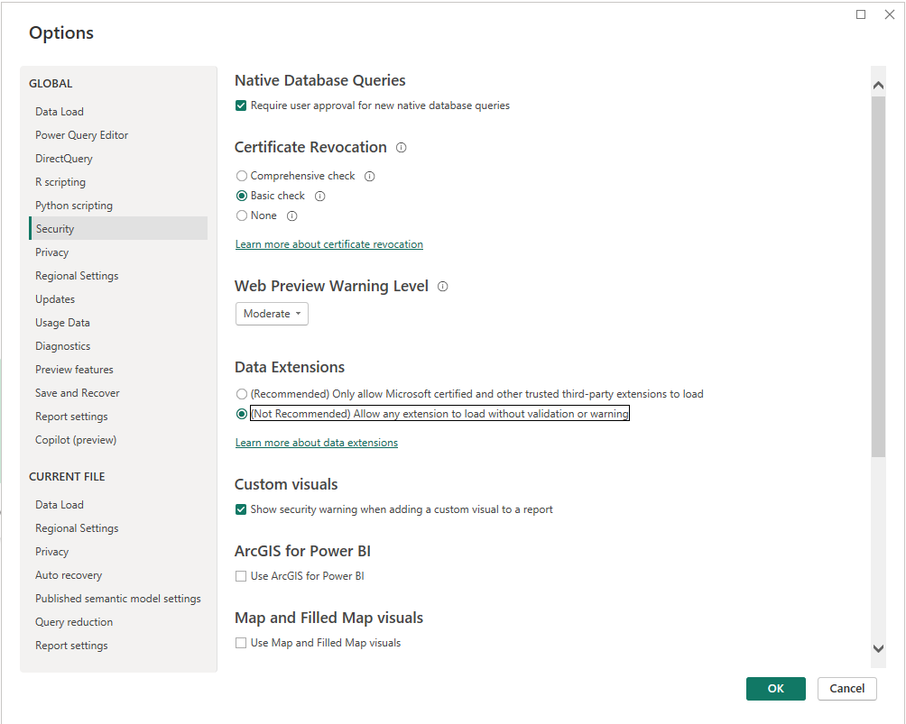

# [GizmoSQL](https://gizmodata.com/gizmosql) Power BI Connector

A Power Query custom connector (`.pqx`) that wraps the [GizmoSQL ODBC driver](https://github.com/gizmodata/gizmosql-odbc-driver), enabling Power BI Desktop users to connect to [GizmoSQL](https://gizmodata.com/gizmosql) via **Get Data > Database > GizmoSQL**.

## Features

- **DirectQuery support** — live queries against GizmoSQL without data import
- **Hierarchical navigation** — browse databases > schemas > tables in the Navigator pane
- **Query folding** — Power BI pushes filters, joins, and aggregations down as SQL (`LIMIT`/`OFFSET`, `CAST`, SQL-92)
- **Authentication** — username/password or token-based auth
- **Signed connector** — `.pqx` is code-signed for integrity verification

## Prerequisites

1. **GizmoSQL ODBC Driver** — install from [gizmosql-odbc-driver releases](https://github.com/gizmodata/gizmosql-odbc-driver/releases)
2. **Power BI Desktop** — [download](https://powerbi.microsoft.com/desktop/)

## Installation

### Signed `.pqx` (recommended)

1. Download `GizmoSQL.pqx` from the [latest release](https://github.com/gizmodata/gizmosql-powerbi-connector/releases/latest)
2. Copy to `[Documents]\Power BI Desktop\Custom Connectors\`
   - Create the folder if it doesn't exist
3. In Power BI Desktop, go to **File > Options > Security > Data Extensions** and select **(Not Recommended) Allow any extension to load without validation or warning**
4. Restart Power BI Desktop
5. The connector appears under **Get Data > Database > GizmoSQL**

> **Note:** The connector is code-signed but not Microsoft-certified. Power BI's default "Recommended" security setting only allows Microsoft-certified connectors and will show this warning:
>
> 
>
> To resolve this, select **(Not Recommended) Allow any extension to load without validation or warning** under **File > Options > Security > Data Extensions**:
>
> 

### Unsigned `.mez` (development)

1. Download `GizmoSQL.mez` from the [latest release](https://github.com/gizmodata/gizmosql-powerbi-connector/releases/latest)
2. Copy to `[Documents]\Power BI Desktop\Custom Connectors\`
3. In Power BI Desktop, go to **File > Options > Security > Data Extensions** and select **(Not Recommended) Allow any extension to load without validation or warning**
4. Restart Power BI Desktop

## Connecting

1. Open Power BI Desktop
2. Click **Get Data > Database > GizmoSQL**
3. Enter:
   - **Server**: hostname or IP address (e.g., `localhost`)
   - **Port**: port number (e.g., `31337`)
4. Choose an authentication method:
   - **Username/Password**: enter your GizmoSQL credentials
   - **Key**: enter a bearer token
5. Click **Connect** and browse the Navigator tree

## Authentication Methods

| Method | ODBC Parameters | Use Case |
|--------|----------------|----------|
| Username/Password | `UID`, `PWD`, `authType=basic` | Standard database credentials |
| Key (Token) | `token`, `authType=token` | Bearer token / JWT authentication |

## DirectQuery

To use DirectQuery mode (live queries without data import):

1. Connect to GizmoSQL as described above
2. When prompted, select **DirectQuery** instead of **Import**
3. Build your report — each visual generates live SQL queries

### Query Folding

The connector declares GizmoSQL's SQL capabilities so Power BI can fold transformations into native SQL:

- `LIMIT` / `OFFSET` (not `TOP`)
- `CAST` (not `CONVERT`)
- Full SQL-92 compliance
- Derived tables (subqueries in `FROM`)
- All standard aggregate functions

To verify query folding, right-click a step in the Power Query Editor and select **View Native Query**.

## Development

### Building locally

```powershell
# Create .mez by zipping connector files
$staging = New-Item -ItemType Directory -Path "staging" -Force
Copy-Item "GizmoSQL.pq","GizmoSQL.query.pq","Diagnostics.pqm","OdbcConstants.pqm","resources.resx" $staging
Copy-Item "icons\*.png" $staging
Compress-Archive -Path "staging\*" -DestinationPath "GizmoSQL.zip"
Rename-Item "GizmoSQL.zip" "GizmoSQL.mez" -Force
```

### Testing with Docker

```bash
# Start a GizmoSQL instance
docker run -p 31337:31337 \
  -e GIZMOSQL_USERNAME=gizmosql_user \
  -e GIZMOSQL_PASSWORD=gizmosql_password \
  -e TLS_ENABLED=0 \
  gizmodata/gizmosql:latest
```

Then connect in Power BI with server `localhost`, port `31337`, username `gizmosql_user`, password `gizmosql_password`.

## Architecture

```
Power BI Desktop
    └── GizmoSQL.pqx (this connector)
        └── GizmoSQL ODBC Driver
            └── gRPC / Arrow Flight SQL
                └── GizmoSQL Server (DuckDB-based)
```

The connector is a Power Query M language section document that wraps `Odbc.DataSource()`, declaring [GizmoSQL](https://gizmodata.com/gizmosql)'s SQL dialect capabilities so Power BI generates compatible SQL for query folding and DirectQuery.

## License

Apache-2.0
